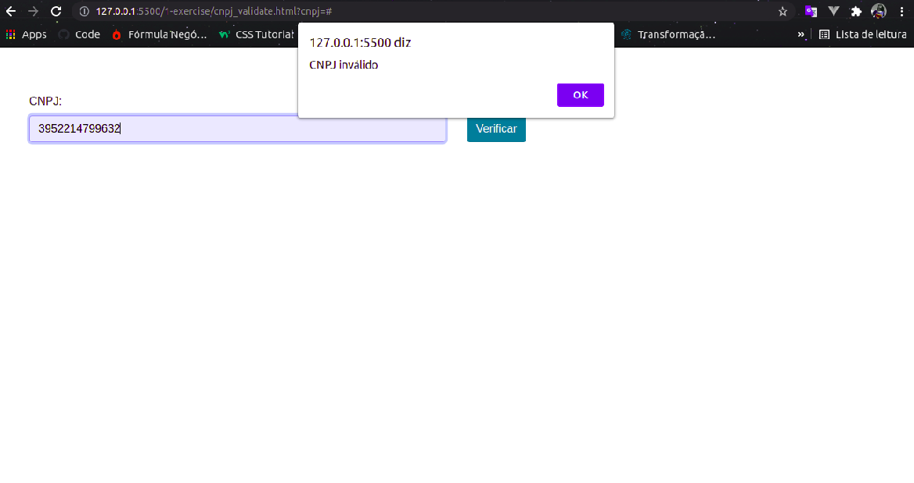
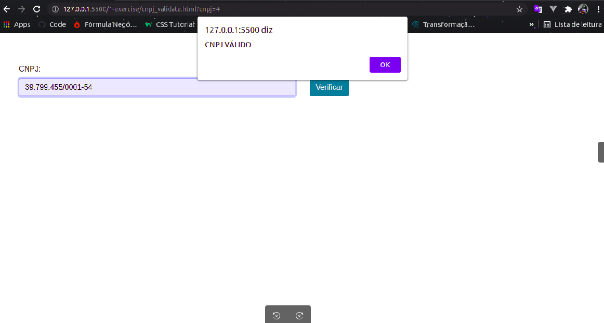
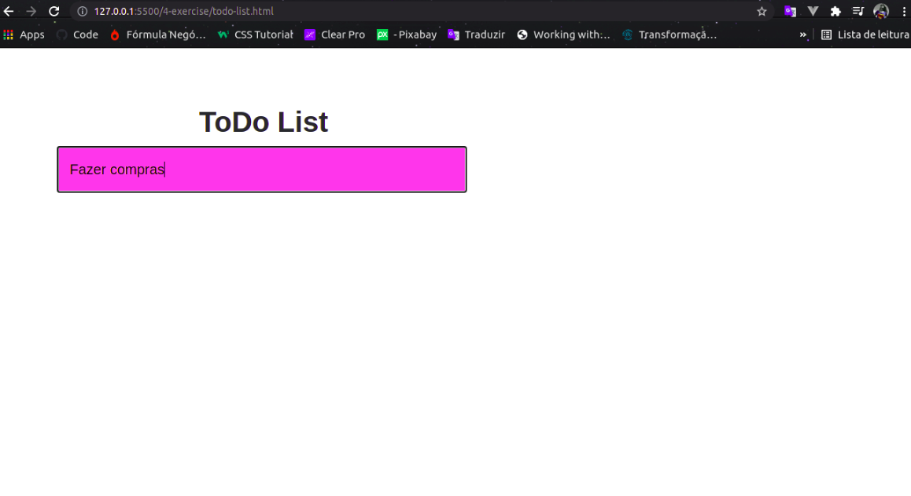
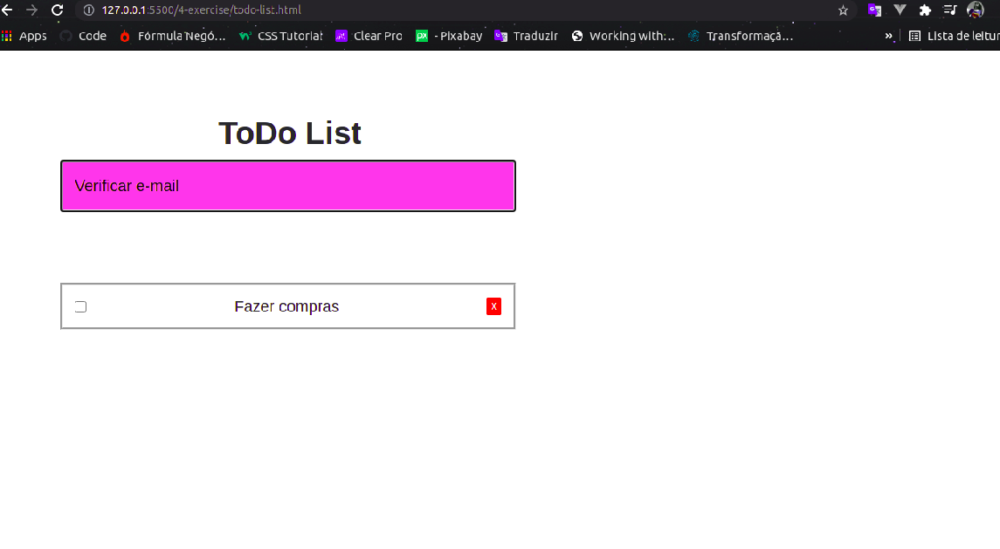
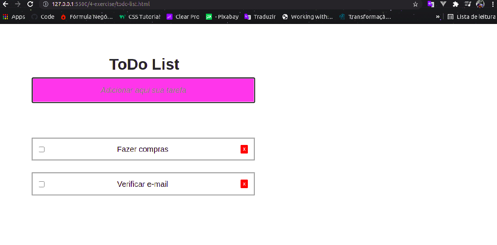
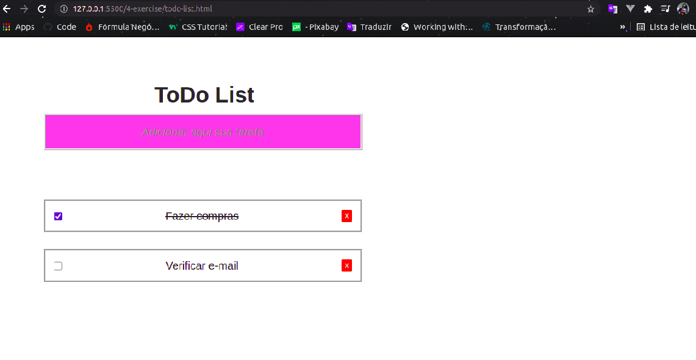
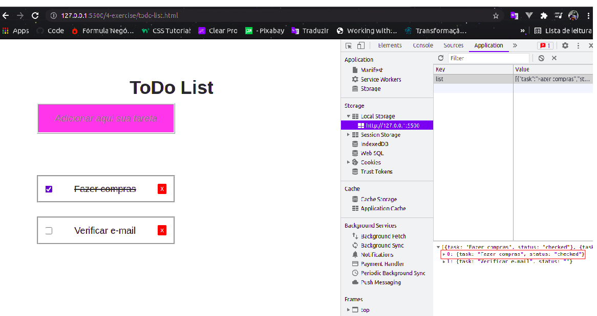
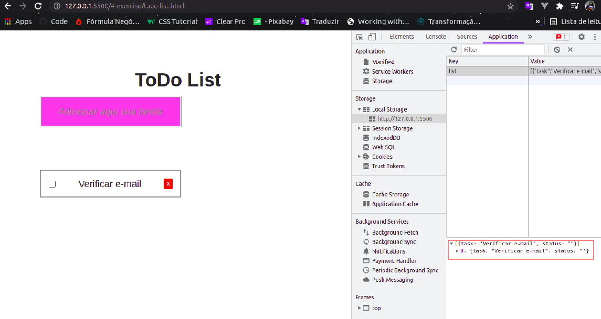

# test-kaffa

Exercício 1 - Validação de CNPJ 

Para rodar o resultado deste exercício basta abrir o html no navegador.
A URL do exercício 1 é: /1-exercise/cnpj_validate.html

Imagens funcionando:

######################################################################################################

Exercício 4 - Simple Todo List

Para rodar o resultado deste exercício basta abrir o html no navegador.
A URL do exercício 1 é: /4-exercise/todo-list.html
Utilizei o banco LocalStorage para salvar as tarefas. É possível abrir o banco ao inspecionar a tela, ir em 'Application' -> 'LocalStorage'. 

Imagens funcionando (Create/Checked/Delete):

