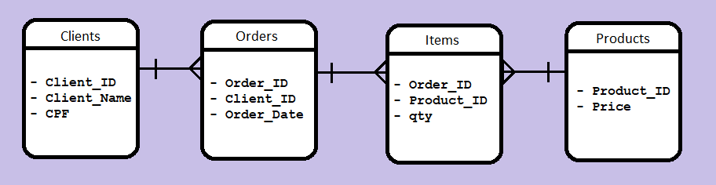

# test-kaffa

Exercício 1 - Validação de CNPJ 

Para rodar o resultado deste exercício basta abrir o html no navegador.
A URL do exercício 1 é: /1-exercise/cnpj_validate.html

Imagens funcionando:

######################################################################################################

Exercício 2 - Rectangles Intersect

Para rodar o resultado deste exercício é preciso abrir a aplicação no navegador usando a URL: /2-exercise/rectangles-intersect.html, ao inspecionar a tela é possível verificar no Console o resultado.
Ou clicar no botão play da IDE (no caso eu utilizei a IDE VSCode) ou abrir o 2-exercise no terminal e digitar 'node rectangles-intersect.js'. O resultado será mostrado no terminal.

Imagens funcionando:

Resultado Intersecção TRUE no Console

Resultado Intersecção TRUE

Resultado Intersecção FALSE

######################################################################################################

Exercício 3 - Area Rectangles Intersect

Para rodar o resultado deste exercício é preciso abrir a aplicação no navegador usando a URL: /3-exercise/area-rectangles.html, ao inspecionar a tela é possível verificar no Console o resultado.
Ou clicar no botão play da IDE (no caso eu utilizei a IDE VSCode) ou abrir o 2-exercise no terminal e digitar 'node area-rectangles.js'. O resultado será mostrado no terminal.

Imagens funcionando:

Resultado Área de Intersecção 15 no Console

Resultado Área de Intersecção 15

Resultado Área de Intersecção 1

######################################################################################################

Exercício 4 - Simple Todo List

Para rodar o resultado deste exercício basta abrir o html no navegador.
A URL do exercício 1 é: /4-exercise/todo-list.html
Utilizei o banco LocalStorage para salvar as tarefas. É possível abrir o banco ao inspecionar a tela, ir em 'Application' -> 'LocalStorage'. 

Imagens funcionando (Create/Checked/Delete):

######################################################################################################

Exercício 5 - Rest Client

Para rodar o resultado deste exercício basta abrir o html no navegador.
A URL do exercício 1 é: /4-exercise/rest-client.html

Imagens funcionando:

######################################################################################################

Exercício 6 - Rest Server

Para rodar o resultado deste exercício é preciso abrir a aplicação no navegador usando a URL: /6-exercise/rest-server.html, ao inspecionar a tela é possível verificar no Console o resultado.

Imagens funcionando:

######################################################################################################

Exercício 7 - Diagram and SQL

O desenho das tabelas estão com o nome de database-diagram.png no diretório 7-exercise.

Segue imagem das tabelas:

 Foi colocado em um arquivo .txt os códigos SQL para listar PEDIDOS com número de itens.

